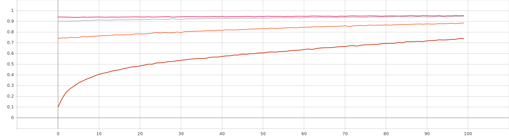
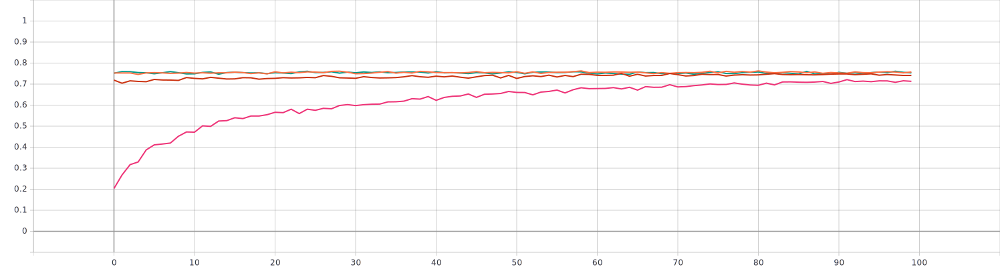
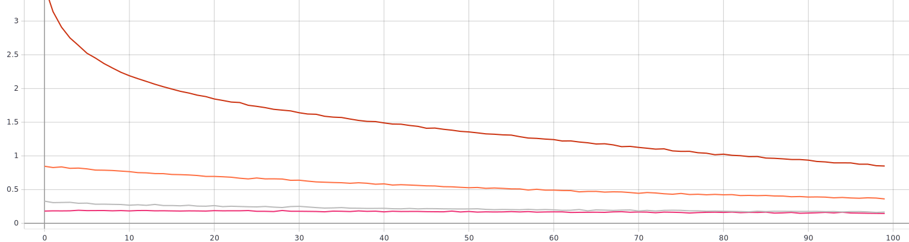
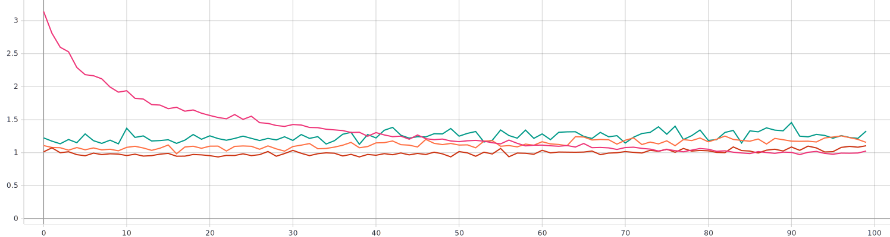
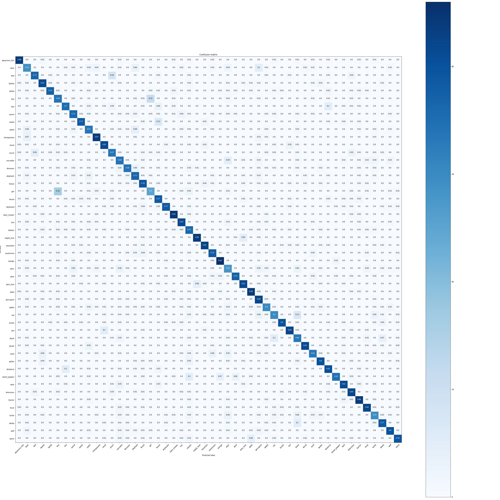

I trained the model at 100 epochs at a time. 
## Training accuracy
Brown: 1-100 epochs 
Orange: 101-200 epochs 
Gray: 201-300 epochs 
Pink: 301-400 epochs

## Validation Accuracy
Pink: 1-100 epochs  
Brown: 101-200 epochs  
Orange: 201-300 epochs  
Green: 301-400 epochs 

## Train Loss
Brown: 1-100 epochs 
Orange: 101-200 epochs 
Gray: 201-300 epochs 
Pink: 301-400 epochs

## Validation Loss:  
Pink: 1-100 epochs  
Brown: 101-200 epochs  
Orange: 201-300 epochs  
Green: 301-400 epochs 

## Training Data Examples
 
As We can see I've reached maximum validation accuracy for this model 
## Confusion Matrix:
 
## Classification Report

|FIELD1       |precision          |recall|f1-score          |support|
|-------------|-------------------|------|------------------|-------|
|aquarium_fish|0.946236559139785  |0.88  |0.911917098445596 |100.0  |
|bear         |0.6041666666666666 |0.58  |0.5918367346938774|100.0  |
|bed          |0.8295454545454546 |0.73  |0.7765957446808511|100.0  |
|beetle       |0.7735849056603774 |0.82  |0.796116504854369 |100.0  |
|bottle       |0.9493670886075949 |0.75  |0.8379888268156425|100.0  |
|boy          |0.5619834710743802 |0.68  |0.6153846153846154|100.0  |
|bus          |0.813953488372093  |0.7   |0.7526881720430109|100.0  |
|camel        |0.7272727272727273 |0.72  |0.7236180904522613|100.0  |
|castle       |0.9166666666666666 |0.77  |0.8369565217391305|100.0  |
|cattle       |0.6146788990825688 |0.67  |0.6411483253588517|100.0  |
|chimpanzee   |0.8446601941747572 |0.87  |0.8571428571428571|100.0  |
|cloud        |0.8137254901960784 |0.83  |0.8217821782178217|100.0  |
|couch        |0.6836734693877551 |0.67  |0.6767676767676768|100.0  |
|crocodile    |0.591304347826087  |0.68  |0.6325581395348838|100.0  |
|dinosaur     |0.7727272727272727 |0.68  |0.7234042553191491|100.0  |
|elephant     |0.6636363636363637 |0.73  |0.6952380952380953|100.0  |
|forest       |0.6902654867256637 |0.78  |0.732394366197183 |100.0  |
|girl         |0.6329113924050633 |0.5   |0.5586592178770949|100.0  |
|house        |0.652542372881356  |0.77  |0.7064220183486238|100.0  |
|keyboard     |0.9058823529411765 |0.77  |0.8324324324324326|100.0  |
|lawn_mower   |0.8557692307692307 |0.89  |0.8725490196078431|100.0  |
|lion         |0.7980769230769231 |0.83  |0.8137254901960785|100.0  |
|lobster      |0.5217391304347826 |0.72  |0.6050420168067228|100.0  |
|maple_tree   |0.8979591836734694 |0.88  |0.888888888888889 |100.0  |
|mountain     |0.85               |0.85  |0.85              |100.0  |
|mushroom     |0.7755102040816326 |0.76  |0.7676767676767676|100.0  |
|orange       |0.8679245283018868 |0.92  |0.8932038834951457|100.0  |
|otter        |0.49557522123893805|0.56  |0.5258215962441315|100.0  |
|pear         |0.891566265060241  |0.74  |0.8087431693989071|100.0  |
|pine_tree    |0.8137254901960784 |0.83  |0.8217821782178217|100.0  |
|plate        |0.8380952380952381 |0.88  |0.8585365853658538|100.0  |
|porcupine    |0.6086956521739131 |0.84  |0.7058823529411766|100.0  |
|rabbit       |0.6818181818181818 |0.6   |0.6382978723404256|100.0  |
|ray          |0.6741573033707865 |0.6   |0.6349206349206349|100.0  |
|rocket       |0.9411764705882353 |0.8   |0.8648648648648648|100.0  |
|sea          |0.865979381443299  |0.84  |0.8527918781725888|100.0  |
|shark        |0.559322033898305  |0.66  |0.6055045871559633|100.0  |
|skunk        |0.9325842696629213 |0.83  |0.8783068783068783|100.0  |
|snail        |0.7586206896551724 |0.66  |0.7058823529411765|100.0  |
|spider       |0.8080808080808081 |0.8   |0.8040201005025126|100.0  |
|streetcar    |0.7570093457943925 |0.81  |0.782608695652174 |100.0  |
|sweet_pepper |0.92               |0.69  |0.7885714285714287|100.0  |
|tank         |0.82               |0.82  |0.82              |100.0  |
|television   |0.7706422018348624 |0.84  |0.8038277511961722|100.0  |
|tractor      |0.7787610619469026 |0.88  |0.8262910798122066|100.0  |
|trout        |0.8076923076923077 |0.84  |0.8235294117647058|100.0  |
|turtle       |0.6413043478260869 |0.59  |0.6145833333333333|100.0  |
|whale        |0.77               |0.77  |0.7699999999999999|100.0  |
|wolf         |0.8333333333333334 |0.8   |0.816326530612245 |100.0  |
|worm         |0.8571428571428571 |0.78  |0.8167539267015708|100.0  |
|accuracy     |0.7578             |0.7578|0.7578            |0.7578 |
|macro avg    |0.7676209266236136 |0.7578|0.7595997029446449|5000.0 |
|weighted avg |0.7676209266236136 |0.7578|0.759599702944645 |5000.0 |
